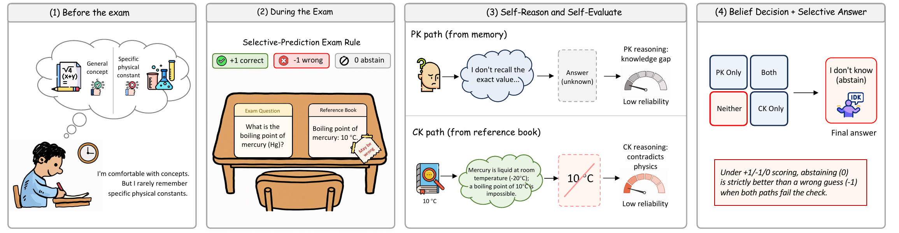
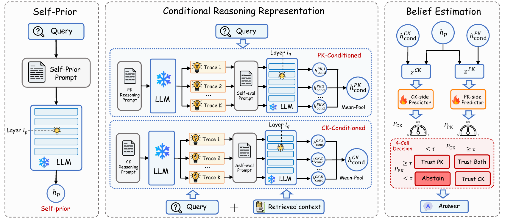

# SABER — Self-Aware Belief Estimator for RAG

Open-source implementation of **Trust or Abstain? A Self-Aware RAG Approach**.

## Overview

Retrieval-augmented generation (RAG) improves large language models (LLMs) by incorporating external context, but it also introduces knowledge conflicts when retrieved contextual knowledge (CK) and parametric knowledge (PK) disagree or are both unreliable. Existing approaches mainly coordinate which source to use, without explicitly asking whether each answer path is correct. We argue that faithful RAG requires LLM self-awareness, namely the ability to recognize the limits of its own knowledge and reasoning. To ground this problem, we construct a model-specific, ground-truth-aligned knowledge-conflict benchmark by evaluating LLM backbones on PK-only and CK-conditioned answer paths over approximately 69K query-context instances per backbone, drawn from five conflict-QA datasets. We then introduce **SABER**, a Self-Aware Belief Estimator for RAG that requires no LLM fine-tuning. SABER combines a self-prior with PK-side and CK-side conditional reasoning representations from multi-trace inference, then estimates reliability beliefs with two lightweight predictors to drive a 4-cell decision over trust PK, trust CK, trust either, or abstain. Across four backbones and five datasets, SABER improves end-to-end accuracy and conflict-specific faithfulness over ten baselines, with the largest gains on conflict-heavy datasets. Under abstention, SABER's risk-coverage curve Pareto-dominates every prompt-based abstainer, providing a tunable balance between coverage and answer risk.

<p align="center">
  
  <br/>
  <em>Figure 1. An open-book exam analogy for faithful RAG. Under a +1 / −1 / 0 scoring rule, a student's memory corresponds to PK and the potentially flawed reference book to retrieved CK. Knowledge-boundary awareness flags when internal knowledge is insufficient; reasoning-reliability awareness flags when the retrieved context leads to an implausible answer. When both paths are unreliable, abstention is preferable to an unsupported guess.</em>
</p>

<p align="center">
  
  <br/>
  <em>Figure 2. The SABER pipeline. The frozen LLM produces a query-only self-prior and per-side conditional reasoning representations via multi-trace generation and self-evaluation. Two lightweight predictors output CK- and PK-beliefs that drive the 4-cell decision with optional abstention.</em>
</p>

---

## What is in this repository

This repository contains the SABER training/evaluation code path
together with a 100-instance-per-dataset sample of the constructed
knowledge-conflict benchmark, so that the implementation can be
inspected end-to-end and a minute-scale smoke check can be run
without a GPU. **The full benchmark (~69K instances per backbone)
will be released upon publication**; full-scale reproduction
additionally requires Hugging Face model weights (see
[Reproducing full results](#7-reproducing-full-results)).

> **TL;DR** — `bash scripts/00_smoke.sh` runs in under a minute on
> CPU and verifies that the package imports, the sample data and
> labels parse correctly, the alias-match cascade reproduces the
> bundled labels, the unit tests pass, and every pipeline entry
> point accepts `--help`.

---

## 1. Repository layout

```
SABER/
├── README.md
├── LICENSE                              # MIT
├── pyproject.toml                       # python>=3.11 + minimal deps
├── data/
│   ├── README.md                        # schema + how to fetch full data
│   ├── splits/saber_split.json          # full benchmark split (qid lists, ~5 MB)
│   ├── datasets/                        # 100-row sample of each of 7 datasets
│   └── evaluation/<backbone>/           # PK/CK behaviour labels matching the sample
├── src/saber/
│   ├── config.py                        # SABER_DATA env var + artefact paths
│   ├── prompts.py                       # shared prompt templates
│   ├── data/                            # dataset builders + alias-match cascade
│   ├── models/registry.py               # 4 supported backbones
│   ├── extract/                         # PK/CK labelling, hidden-state extraction,
│   │                                    # multi-trace reasoning generation
│   ├── methods/saber_probe.py           # core SABER probe + 4-cell decision
│   ├── baselines/                       # prompt-based & trained baselines
│   └── metrics/                         # Acc, CF, KF, MFS, Score, Cov, R_C, F_1
├── scripts/                             # 7 numbered scripts (00 = smoke, 01-06 = pipeline)
└── tests/test_alias_match.py            # unit tests
```

The pipeline stages map one-to-one with the paper:

| Paper section | Module | Script |
|---|---|---|
| §3 benchmark construction (Eq. 1-2) | `saber.extract.label_pk_ck` | `01_label_pk_ck.sh` |
| §3.1 self-prior representation | `saber.extract.extract_hidden` | `02_extract_hidden.sh` |
| §3.2 multi-trace reasoning + self-evaluation | `saber.extract.multipath_vllm_gen` + `multipath_hf_postgen` | `03_gen_multipath.sh` |
| §3.3 PK + CK belief estimation, 4-cell decision | `saber.methods.saber_probe` | `04_train_saber.sh` |
| §5.2 baselines | `saber.baselines.run` | `05_run_baselines.sh` |
| §5.1 + §5.3 main / selective metrics | `saber.metrics.joint_metrics` | `06_evaluate.sh` |

## 2. Install

```bash
git clone https://github.com/xizhu1022/SABER.git
cd SABER
pip install -e .                # base
pip install -e ".[vllm]"        # optional, for accelerated trace generation
```

Python `>=3.11` is required. Core dependencies are `torch`, `transformers`,
`scikit-learn`, `numpy`, `pandas`, `tqdm`, `pyyaml`. All requirements are
pinned in `pyproject.toml`.

## 3. Smoke check (no GPU, no model weights, < 1 minute)

```bash
export SABER_DATA=$(pwd)/data
bash scripts/00_smoke.sh
```

Expected output ends with `ALL SMOKE CHECKS PASSED`. The smoke script
performs five separate verifications:

1. **Imports** — every module in `saber/` imports without error.
2. **Sample data parses** — each of the 7 dataset files has 100 rows
   with the required schema fields.
3. **Behaviour alignment** — the bundled PK/CK labels cover exactly
   the sampled qids on all four backbones.
4. **Alias-match cascade** — re-running `alias_match` on the sampled
   rows reproduces the bundled labels (48/50 PK and 48/50 CK or
   better, on a 50-row spot-check).
5. **Entry-point health** — `pytest tests/` and `--help` on each
   pipeline entry point.

If any step fails, the script exits non-zero and prints the failing
check.

## 4. End-to-end on the sample (requires GPU + Hugging Face weights)

The full pipeline scripts assume a single GPU and read/write under
`artifacts/<backbone>/` relative to the current directory. They use
exactly the same module commands the paper uses; they will run on the
700-qid sample without modification (substitute the appropriate
backbone short name).

```bash
export SABER_DATA=$(pwd)/data

bash scripts/01_label_pk_ck.sh    llama-3.1-8b-instruct   # PK/CK answer paths
bash scripts/02_extract_hidden.sh llama-3.1-8b-instruct   # self-prior hidden state
bash scripts/03_gen_multipath.sh  llama-3.1-8b-instruct   # K=3 reasoning traces
bash scripts/04_train_saber.sh    llama-3.1-8b-instruct   # train PK + CK heads
bash scripts/05_run_baselines.sh  llama-3.1-8b-instruct   # prompt-based baselines
bash scripts/06_evaluate.sh       llama-3.1-8b-instruct   # Acc/CF/KF/MFS + abstention
```

Wall-clock on a single 24 GB GPU for the 700-qid sample: roughly
30 minutes for steps 1-3, and seconds for steps 4-6. Outputs land in
`artifacts/<backbone>/`:

```
artifacts/<backbone>/
├── hidden/<dataset>.{hidden,hidden_nock}.npy + .meta.jsonl + .config.json
├── traces/<dataset>.K{k}.traces.jsonl
├── cond/<dataset>.K{k}.{cond_pk,cond_ck}.npz + .meta.jsonl
├── saber_probe.pt
├── saber_decisions.jsonl
├── baselines/<method>/answers_<dataset>.jsonl
└── metrics.json
```

## 5. Backbones

| short name | Hugging Face id |
|---|---|
| `llama-3.1-8b-instruct` | `meta-llama/Llama-3.1-8B-Instruct` |
| `llama-3.2-3b-instruct` | `meta-llama/Llama-3.2-3B-Instruct` |
| `qwen2.5-7b-instruct`   | `Qwen/Qwen2.5-7B-Instruct` |
| `qwen2.5-3b-instruct`   | `Qwen/Qwen2.5-3B-Instruct` |

`src/saber/models/registry.py` is the single source of truth for
backbone metadata and adding a new backbone is a one-line edit there.

## 6. Hyperparameters (final values used in the paper)

| Component | Setting |
|---|---|
| Probe hidden sizes | (256, 128) |
| Dropout / optimiser | 0.2 / AdamW (lr 1e-3, wd 1e-4) |
| Batch size | 256 |
| Max epochs | 50, early stop on val AUROC (patience 8) |
| Reasoning traces per side, $K$ | 3 |
| Sampling | T=0.9, top-p=1.0, rep-pen=1.05, max-new=256 |
| Abstention threshold $\tau$ | 0.5 (uniform across all backbones) |
| Layer choices | per-backbone, selected on validation (see paper §5.5 / appendix) |

## 7. Reproducing full results

`data/splits/saber_split.json` already enumerates the 80 / 10 / 10
train / val / test partition (~69 K qids per backbone) used in the
paper, so the only missing piece is the raw data. To reconstruct the
full benchmark:

1. Download the upstream datasets and place them at
   `$SABER_DATA/datasets/<name>.jsonl`, keeping the file names below:

   | Dataset | Upstream source |
   |---|---|
   | ConFiQA (QA / MR / MC) | <https://github.com/byaspring/ConFiQA> |
   | ConflictQA-PopQA       | <https://github.com/AlibabaResearch/ConflictQA> |
   | ConflictBank           | <https://github.com/zhaochen0110/ConflictBank> |
   | TriviaQA (adversarial) | Huang et al., 2025 (Situated Faithfulness) |
   | NQ (adversarial)       | same source as above |

2. Re-run `scripts/01_label_pk_ck.sh <backbone>` for each backbone to
   regenerate `data/evaluation/<backbone>/behavior_*.jsonl` against
   the full data.

3. Run `scripts/02-06` for each backbone.

Approximate full-scale runtime on a single 24 GB GPU, summed over 4
backbones × 7 datasets:

- Hidden-state extraction: ~15 GPU-hours total (one-time, frozen).
- Multi-trace generation + self-eval: ~30 GPU-hours total.
- Probe training + evaluation: well under 1 GPU-hour total.

## 8. Tests

```bash
pytest tests/
```

The unit tests cover the alias-match cascade used both at labelling
time and at evaluation time. They are the same checks that
`scripts/00_smoke.sh` runs at the end.

## 9. Notes

- All file paths are resolved relative to `$SABER_DATA`
  (default `./data` under the repo root).
- The trained baselines (CR-DPO, R-Tuning) ship as inference adapters
  here; their training procedures follow the original papers
  cited in §C of the appendix.
- The 100-row data sample is large enough to exercise every script
  end-to-end and to inspect the JSONL schemas, but is not intended
  as a sufficient test set for any quantitative claim. **The full
  benchmark will be released upon publication.**

## 10. License

MIT — see `LICENSE`.
